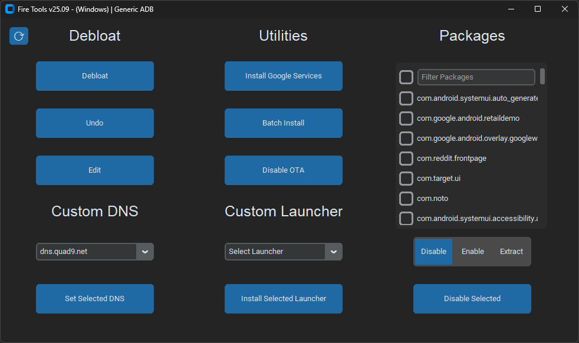

## Fire Tools
Fire Tools is a powerful collection of tools that helps debloat and install Google services on your Fire Tablet to make it feel snappier and improve usability. Additionally, it supports custom launchers such as Nova, Lawnchair, or any `.apk(m)`. If you need to install multiple apps quickly, there's a batch installer. It's as easy as dropping all your `.apk(m)`s in the Batch folder and clicking the Batch Install button! No root required!



**Features:**
* Cross Platform (Linux, macOS, & Windows)
* Powerful Debloat Tool
* Google Play Installer (Android 8+/Fire OS 7+)
* Custom Launcher Support
* Disable OTA Updates
* Apk Extractor
* Batch Installer (.apk & .apkm files)
* Private DNS Switcher

**Installation Instructions:**

Follow the steps outlined in [Setup-Instructions.md](/Setup-Instructions.md) then proceed to installation. After installation run update tool to get the latest version of scripts!

**Linux/macOS:**

``` shell
# Download Latest Release & Extract, Then Run
curl -LO https://github.com/mrhaydendp/fire-tools/releases/latest/download/Fire-Tools.zip
unzip Fire-Tools.zip && rm Fire-Tools.zip
cd Fire-Tools && python3 main.py
```

**Windows Powershell:**

``` powershell
# Download Latest Release & Extract, Then Open in Explorer
Start-BitsTransfer "https://github.com/mrhaydendp/fire-tools/releases/latest/download/Fire-Tools.zip"
Expand-Archive Fire-Tools.zip; mv Fire-Tools\Fire-Tools\* Fire-Tools
Remove-Item Fire-Tools.zip, Fire-Tools\Fire-Tools
Set-Location Fire-Tools; python main.py
```

**Important Notes:**

* Some features of the Fire Tools may break due to Fire OS updates but I'll try my best to keep them working.
* Set timezone settings before debloat! (re-enable `com.amazon.kindle.otter.oobe` to change date & time settings)
* Google Apps are downloaded from [ApkMirror](https://www.apkmirror.com/) and are included in releases for convienence see [terms](https://github.com/mrhaydendp/Fire-Tools/blob/main/Fire-Tools/Gapps/README.md).
* Debloat will disable most amazon apps with the exception of: `Calculator`, `Camera`, `Clock`, `Files`, `Fire Launcher`, `Silk Browser`, and `Settings`
* Warranty and Reset: Using Fire Tools doesn't void your warranty and all changes can be reversed with a factory reset.
* Disclaimer: While I developed this tool, I am not responsible for any issues arising from its use.
  
**Credits:**  Fire Tools thanks and acknowledges the following projects. They are included for your convenience:

* [Google](https://www.android.com/) (GApps)
* [TeslaCoil Software](https://novalauncher.com/) (Nova Launcher)
* [Lawnchair](https://github.com/LawnchairLauncher/Lawnchair) (Lawnchair)
* [BaronKiko](https://github.com/BaronKiko/LauncherHijack) (LauncherHijack)
* [D0k3](https://github.com/d0k3/OneClick-for-Amazon-Fire) (Inspired by their OneClick-for-Amazon-Fire tool)
