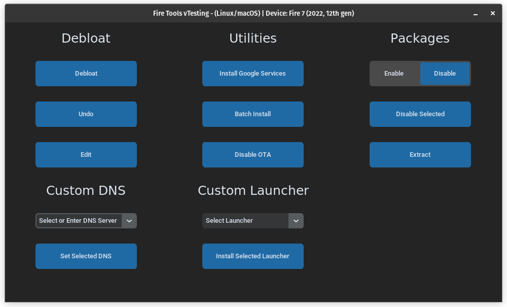

# Fire Tools
Fire Tools is a powerful script that debloats and installs Google services to Amazon Fire Tablets to make them feel snappier and increase the ease of use. In addition it also allows you to install custom launchers such as Nova and Lawnchair. If you wish to add your own apps theres a custom batch installer. It's as easy as putting your `.apk` files into the Custom folder and clicking the Batch-Install button!

**Note this tool requires USB Debbuging to be enabled**

## Supported Devices
- Fire HD 10 (9th Gen, 11th Gen)
- Fire HD 8 (8th Gen, 10th Gen)
- Fire 7 (9th Gen)

Linux/macOS             |  Windows
:-------------------------:|:-------------------------:
  |  

## Installer Script
For Linux, WSL, and macOS run this command in terminal:
```
wget https://github.com/mrhaydendp/fire-tools/releases/latest/download/Fire-Tools.tar.xz
tar -xf Fire-Tools.tar.xz && rm Fire-Tools.tar.xz
cd Fire-Tools && ./ui.sh
```

For Windows open Powershell and paste these commands:
```
Start-BitsTransfer https://github.com/mrhaydendp/fire-tools/releases/latest/download/Fire-Tools.tar.xz
tar -xf Fire-Tools.tar.xz
```
Then right click on `Fire-Tools.ps1` and open in powershell

## Setup
- [Linux/macOS](./Linux-Instructions.md)
- [Windows](./Windows-Instructions.md)
- [Config Options](./Config%20Options.md)

## Fire Tablet Prep
### Enable Developer Options & USB Debugging
Open `Settings` and go to `Device Options` then scroll down and and tap `About Fire Tablet`


Then tap `Serial Number` 7 times it should say you are 2 taps away after the 5th tap


Press the back button and `Developer Options` will now be visible


Now switch on `Developer Options` and `USB Debugging`. Then get a USB cable that supports data transfer (preferrably the one in the box) and plug it into the computer.


## Notes
Things you should know:
- Set timezone settings before debloat! 
- You are allowed to fork this script and make your own for your use cases but you have to credit me and link back to this project
- Google Apps are downloaded from [ApkMirror](https://www.apkmirror.com/) and are updated to the latest supported `.apk` or `.apkm`
- Debloat will disable all amazon apps except `Calculator`, `Camera`, `Clock`, `Files`, `Home`, and `Settings`
- This should not void your warranty but, if unsure factory reset your device before sending it in.
- Although this is my tool, **I am not responsible for anything that may go wrong when using this script.**

## Credits
Thank you to all these people's software included in this script!
- [Google](https://www.android.com/) (Gapps)
- [Aefyr](https://github.com/Aefyr/SAI) (Split APKs Installer)
- [TeslaCoil Software](https://play.google.com/store/apps/developer?id=TeslaCoil%20Software&hl=en_US&gl=US) (Nova Launcher)
- [Lawnchair](https://github.com/LawnchairLauncher/Lawnchair)
- [D0k3](https://github.com/d0k3) (For inspiration to make this script)
