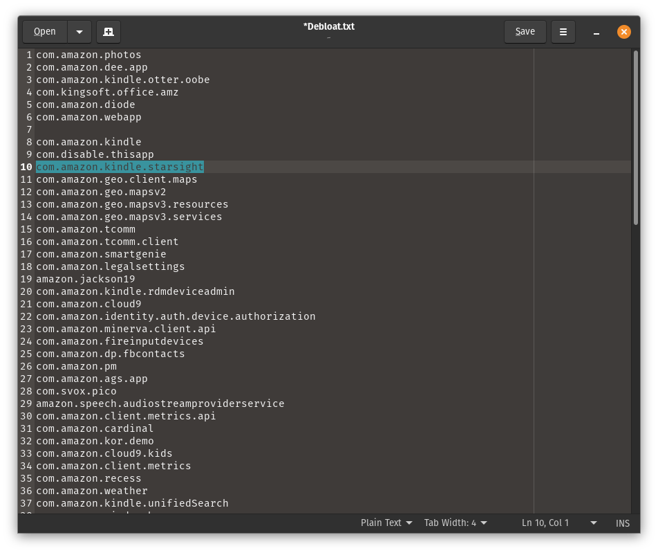
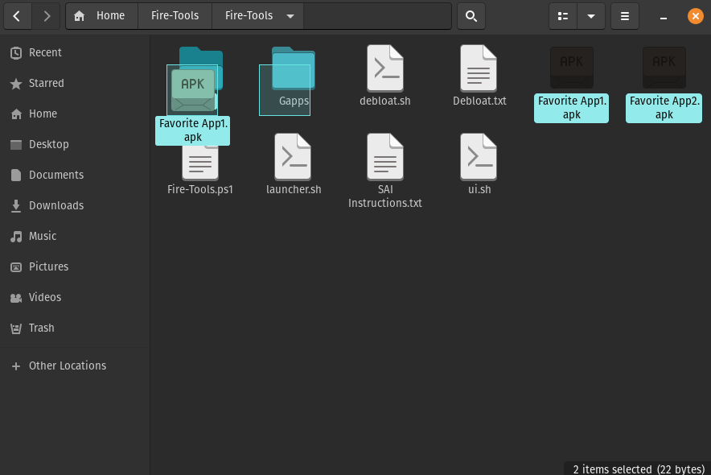

# Config Options

## Debloat
Add or remove package names from Debloat.txt

## Custom Debloat
Hold `Ctrl` and click on packages to disable multiple packages

## Batch Install
Add `.apk` files to Batch folder

